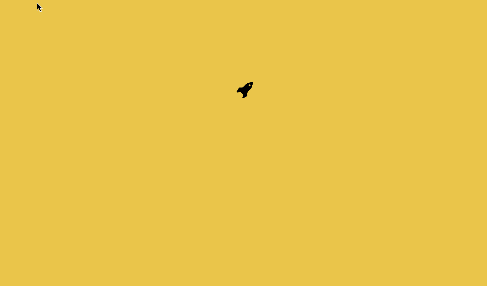

# react-rectangle-popup-menu


React rectangle popup menu library. [Demo](https://sasha240100.github.io/react-rectangle-popup-menu/examples/)



### `<PopupMenu />`

```js
class Popup {
  render() {
    <PopupMenu>
    	// Content
    </PopupMenu>
  }
}
```

#### Parameters for `<PopupMenu />`

```js
{
	width: ?number = 200,
	height: ?(number | 'auto') = 'auto', // If auto it's minimized to rows size
	direction: ?('top' | 'bottom' | 'left' | 'right') = 'top'
}
```

### `<PopupTable />`

```js
import FontAwesome from 'react-fontawesome';

const button = (<FontAwesome name="rocket" size="2x" />);

class Popup {
  render() {
    <PopupMenu width={190} direction="bottom" button={button}>
      <PopupTable rowItems={4}>
        <FontAwesome name="google-plus-square" size="2x" />
        <FontAwesome name="twitter-square" size="2x" />
        <FontAwesome name="google" size="2x" />
        <FontAwesome name="google" size="2x" />

        <FontAwesome name="facebook-official" size="2x" />
        <FontAwesome name="twitter-square" size="2x" />
        <FontAwesome name="spotify" size="2x" />
        <FontAwesome name="twitter-square" size="2x" />

        <FontAwesome name="google-plus-square" size="2x" />
        <FontAwesome name="google" size="2x" />
        <FontAwesome name="twitter-square" size="2x" />
      </PopupTable>
    </PopupMenu>
  }
}
```

#### Parameters for `<PopupTable />`

```js
{
	// Items per row (used to generate normal width of placeholder)
	rowItems: ?number = 1
}
```

### `<PopupText />`
```js
class Popup {
  render() {
    <PopupMenu width={190} direction="bottom" button={button}>
      <PopupText>Some text</PopupText>
    </PopupMenu>
  }
}
```
